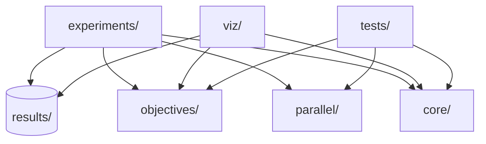

# Diseño del Proyecto: PSO y Programación Paralela

## 1. Objetivo del proyecto

Este proyecto implementa **Particle Swarm Optimization (PSO)** y compara varias estrategias de ejecución para estudiar rendimiento y comportamiento en diferentes funciones objetivo. El enfoque principal es mantener una base común del algoritmo y variar solo la estrategia de evaluación/cómputo para analizar coste, escalabilidad y trade-offs prácticos.

Los objetivos concretos son:
- Resolver problemas de optimización continua con PSO.
- Comparar estrategias secuenciales, concurrentes y vectorizadas.
- Medir tiempos de evaluación, actualización y ejecución total.
- Guardar resultados reproducibles para análisis posterior.

## 2. Arquitectura general del repositorio

La arquitectura separa responsabilidades por carpetas:
- `core/`: implementación base de PSO, parámetros, límites y políticas.
- `objectives/`: benchmarks matemáticos y caso aplicado WSN.
- `parallel/`: evaluadores alternativos para V1, V2 y V3.
- `experiments/`: scripts de ejecución (simple, benchmarks, grid search, análisis).
- `viz/`: visualizaciones de convergencia y del caso WSN.
- `tests/`: pruebas unitarias y de regresión básica.
- `results/`: salida persistente de experimentos y análisis.

## 3. Diagrama de dependencias (Mermaid)

## 4. Explicación de módulos

### `core/`
Contiene la lógica común del PSO: estado de partículas, bucle iterativo, control de parada, límites de búsqueda y métricas de tiempo. Esta capa no depende de una estrategia de paralelismo concreta; recibe un evaluador intercambiable.

### `objectives/`
Define funciones objetivo estándar (Sphere, Rosenbrock, Rastrigin, Ackley) y el caso aplicado WSN. También centraliza `BENCHMARKS`, que expone función y límites por objetivo para que los scripts de experimentos se configuren sin duplicación.

### `parallel/`
Incluye implementaciones de evaluadores:
- V1 con `ThreadPoolExecutor`.
- V2 con `ProcessPoolExecutor`.
- V3 con `asyncio` para simular latencia.

Cada evaluador mantiene la interfaz esperada por el core (`evaluate_batch`).

### `experiments/`
Scripts de línea de comandos para:
- ejecución simple (`run_pso.py`),
- barridos sistemáticos (`run_benchmarks.py`),
- búsqueda de hiperparámetros (`run_grid_search.py`),
- análisis agregado de resultados (`analyze_results.py`).

### `viz/`
Genera visualizaciones de convergencia y, para WSN, mapa de cobertura final con posiciones de sensores.

### `tests/`
Valida funcionamiento mínimo del sistema: convergencia, reproducibilidad por semilla, salida esperada, compatibilidad async/vectorizada y serialización donde aplica.

## 5. Decisión de diseño: core común + estrategias intercambiables

Se eligió una arquitectura con **core PSO único** y evaluadores intercambiables para evitar duplicar lógica. Con este diseño:
- La comparación entre estrategias es más justa (mismo algoritmo base).
- El mantenimiento es más simple (cambios funcionales en un solo lugar).
- Se reduce riesgo de introducir diferencias no deseadas entre variantes.

## 6. Decisión de diseño: eliminación de `io/`

Se eliminó la carpeta `io/` porque estaba vacía y su nombre podía confundirse con el módulo estándar `io` de Python. Evitar esa colisión reduce ambigüedad en imports y mejora claridad del proyecto.

## 7. Benchmarks implementados

Se incluyen cuatro benchmarks clásicos de optimización continua:
- **Sphere**
- **Rosenbrock**
- **Rastrigin**
- **Ackley**

Estos problemas cubren distintos perfiles de dificultad (convexidad, acoplamiento entre variables, multimodalidad) y sirven como base de comparación entre estrategias.

## 8. Caso aplicado WSN

### Qué optimiza
El caso WSN optimiza la **cobertura media de un área rectangular** mediante ubicación de sensores.

### Variables de decisión
Cada partícula codifica las coordenadas 2D de `M` sensores:
`[x1, y1, x2, y2, ..., xM, yM]`.

### Función objetivo
Para cada punto de rejilla y cada sensor:
- `p_i = exp(-alpha * distancia^2)`
- `coverage_point = 1 - product(1 - p_i)`

Cobertura media del área:
- `coverage_mean = mean(coverage_point)`

Como PSO minimiza:
- `fitness = 1 - coverage_mean`

### Por qué tiene múltiples óptimos locales
La superposición de coberturas de varios sensores genera un paisaje no convexo con simetrías, redundancias y zonas de saturación parcial, lo que produce múltiples configuraciones competitivas y óptimos locales.

### Por qué sirve para evaluar paralelismo
Cada evaluación requiere muchas operaciones por punto de rejilla y por sensor. Ese coste repetido por partícula/iteración lo hace útil para comparar overhead y beneficio entre estrategias de concurrencia y vectorización.

## 9. Estrategias comparadas

- **V0 secuencial**: baseline simple.
- **V1 threading**: evaluación por hilos.
- **V2 multiprocessing**: evaluación por procesos.
- **V3 asyncio**: concurrencia cooperativa con latencia simulada.
- **V4 NumPy vectorizado**: paralelismo implícito por operaciones vectoriales.

## 10. Trade-offs principales

- **Threading y GIL**: en cargas CPU puras, el GIL limita paralelismo real; puede ayudar más en tareas con espera.
- **Multiprocessing**: evita GIL, pero introduce costes de IPC, arranque de procesos y pickling.
- **Asyncio**: útil cuando hay latencia/I-O simulada; menos ventajoso para cómputo CPU puro sin esperas.
- **Vectorización NumPy**: reduce bucles Python y overhead interpretado, pero depende de que la operación se adapte a cálculo matricial.

## 11. Persistencia y resultados

Los scripts guardan resultados en `results/`:
- `summary.csv`: resumen por ejecución.
- `metadata.json`: configuración y contexto de ejecución.
- `history.csv`: historial de convergencia cuando aplica.

El análisis posterior produce, entre otros:
- `analysis_summary.csv`
- gráficos comparativos de tiempos y convergencia.

## 12. Limitaciones

- Los experimentos suelen ser reducidos para contener coste de ejecución.
- Los tiempos dependen del hardware y del entorno de ejecución.
- V3 modela un escenario asíncrono simulado con latencia artificial.
- El caso WSN usa un modelo simplificado (rejilla regular y detección probabilística simplificada).
